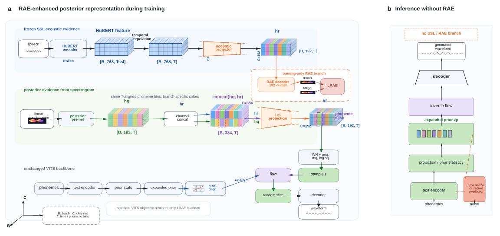

# PRL-VITS: Posterior Representation Learning for Text-to-Speech

<p align="center">
  
</p>

<p align="center">
  A VITS-based text-to-speech framework that strengthens <b>training-time posterior representation learning</b>
  with frozen HuBERT acoustic evidence, posterior fusion, and reconstruction regularization.
</p>

## Overview

This repository contains our implementation of **PRL-VITS**, a VITS extension designed to improve posterior-side acoustic representation learning during training while keeping the original inference path unchanged.

Compared with baseline VITS, PRL-VITS introduces frozen self-supervised speech features into the posterior branch, projects them into the posterior latent space, fuses them with spectrogram-derived posterior evidence, and regularizes the injected representation with an auxiliary Mel reconstruction objective.

The core idea is simple:

- use **HuBERT** as a strong frozen acoustic teacher during training,
- enhance the **posterior path** instead of modifying the text-to-waveform inference pipeline,
- remove the extra branch at inference time so generation cost stays unchanged.

## First Innovation Point

### HuBERT-Guided Posterior Acoustic Injection

The first key innovation of PRL-VITS is to strengthen the posterior branch with **training-only self-supervised acoustic evidence**.

In vanilla VITS, posterior statistics are estimated mainly from the spectrogram-side posterior feature. In PRL-VITS, we additionally extract frozen HuBERT representations from target speech and inject them into the posterior path through three steps:

1. **Acoustic projection**
   - HuBERT features are mapped from the original SSL feature dimension to the posterior hidden-channel space.
   - In code, this is implemented by `ssl_proj` in [models.py](models.py).

2. **Posterior fusion**
   - The projected HuBERT feature is concatenated with the spectrogram-derived posterior feature.
   - A lightweight `1x1` convolution compresses the fused representation back to the original posterior width.
   - In code, this corresponds to `self.fusion(...)` in [models.py](models.py).

3. **Training-only removal at inference**
   - The HuBERT path is only used during training.
   - Inference still follows the original VITS text-conditioned generation route, so no extra runtime cost is introduced.

This design makes the posterior encoder learn from both:

- low-level spectral evidence from the target spectrogram,
- high-level acoustic and phonetic regularities encoded by HuBERT.

## Method Highlights

- **Posterior-side acoustic enhancement** rather than decoder-side feature injection.
- **Frozen HuBERT teacher** for robust training supervision.
- **Auxiliary reconstruction regularization** via a Mel decoder on the projected SSL representation.
- **No inference overhead** compared with baseline VITS.
- **Single-speaker and multi-speaker support** through the existing `train.py` and `train_ms.py` pipelines.

## Code Mapping

The main implementation related to PRL-VITS is concentrated in the following files:

- [models.py](models.py)
  - posterior-side SSL projection: `ssl_proj`
  - posterior fusion: `fusion`
  - auxiliary reconstruction decoder: `rae_decoder`
- [data_utils.py](data_utils.py)
  - loading cached HuBERT features
  - temporal interpolation to target spectrogram length
- [extract_hubert_features.py](extract_hubert_features.py)
  - offline HuBERT feature extraction script
- [train.py](train.py)
  - single-speaker training pipeline
- [train_ms.py](train_ms.py)
  - multi-speaker training pipeline
- [configs/](configs)
  - experiment configuration files

## Repository Structure

```text
vits-main/
├─ configs/                     # training configs
├─ filelists/                   # train/val/test filelists
├─ resources/                   # figures used in README
├─ text/                        # text frontend
├─ data_utils.py                # dataset loading, SSL feature loading
├─ extract_hubert_features.py   # offline HuBERT feature extraction
├─ models.py                    # PRL-VITS posterior fusion implementation
├─ train.py                     # single-speaker training
├─ train_ms.py                  # multi-speaker training
└─ inference.py / inference.ipynb
```

## Quick Start

### 1. Install dependencies

```bash
pip install -r requirements.txt
```

For some environments you may also need:

```bash
apt-get install espeak
```

### 2. Build monotonic alignment search

```bash
cd monotonic_align
python setup.py build_ext --inplace
```

### 3. Prepare HuBERT features

Extract and cache HuBERT features before PRL-VITS training:

```bash
python extract_hubert_features.py \
  --filelists filelists/ljs_audio_text_train_filelist.txt \
              filelists/ljs_audio_text_val_filelist.txt \
              filelists/ljs_audio_text_test_filelist.txt
```

### 4. Training

Single-speaker:

```bash
python train.py -c configs/ljs_base.json -m ljs_base
```

Multi-speaker:

```bash
python train_ms.py -c configs/vctk_base.json -m vctk_base
```

## Practical Notes

- HuBERT features are loaded as cached tensors rather than extracted online during training.
- If feature length does not match spectrogram length, the loader interpolates the SSL feature sequence to the target frame length.
- If SSL features are missing, training will fail fast with an explicit file-not-found error.

## Inference

See [inference.ipynb](inference.ipynb) or [inference.py](inference.py).

The PRL branch is designed for training-time posterior enhancement, so inference remains close to the baseline VITS workflow.

## Acknowledgement

This codebase is built on top of the original VITS implementation and adapts it for posterior representation learning experiments with HuBERT-guided acoustic evidence.


